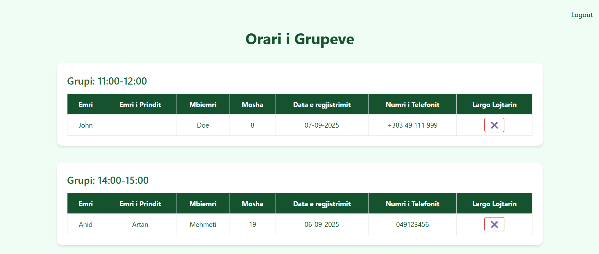

**🏀 Mitrobasket Website**
This is a local web application I built for Mitrobasket, a youth basketball school in Mitrovica founded by my father, a former professional basketball player. The project showcases the school, coaches, training programs, a registration form, and contact information. The goal was to create a lightweight, fast, and responsive site tailored for local use. The content is written in Albanian, as it targets an Albanian-speaking audience.

✅ Built with: Python (Flask) · HTML · Tailwind CSS · JavaScript

**🔧 Features**
⚡️ Fast and responsive UI using Tailwind CSS
🧠 Form validation with JavaScript and Flask backend
📂 Simulated database logic (stores player info temporarily)
📤 Coach view that organizes players by age group
🌐 Runs locally on localhost

**📸 Pages Included**
index.html	- Main landing page with information and sign-up form
login.html - Coach login page (simple authentication)
coach.html - Coach dashboard displaying registered players
registration.html	- Confirmation page with player practice time slot

**🧪 How to Run Locally**
_1. Clone the repo_
   
git clone https://github.com/anidmehmeti/mitrobasket.git
cd mitrobasket

_2. Create a virtual environment (optional but recommended)_

python -m venv venv
source venv/bin/activate  # or venv\Scripts\activate on Windows

_3. Install dependencies_

pip install -r requirements.txt

_4. Run the app_

python app.py

_5. Open in browser_

Go to http://127.0.0.1:5000/

**📌 Notes**
This project is for local use only — not deployed online.

Form submission clears inputs on success, and errors are handled on both the client and server sides.

No database is used — just temporary in-memory storage for now.

**👨‍💻 Author**
Anid Mehmeti

🏫 RIT Kosovo — Computer & Information Technology

🔗 https://www.linkedin.com/in/anidmehmeti/

**🖼️ Screenshots**

Mitrobasket Landing Page

Mitrobasket Registration Form

Mitrobasket Confirmation Page

Mitrobasket Coach View

**Future Improvements**
Use a real database (e.g., SQLite or PostgreSQL)

Implement CSRF protection or deploy securely

Clean up UI with Tailwind further (dark mode, accessibility)

**📎 License**
This project is for educational and demonstration purposes.
